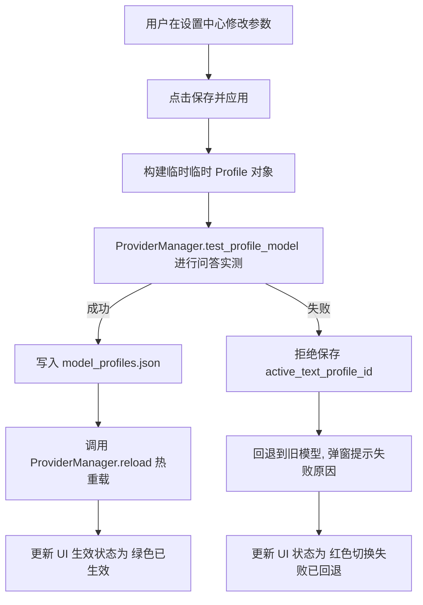

# 模型配置与 Provider 切换技术规范说明书 (v0.49 Spec)

本规范定义了 Daniya 桌宠系统的模型配置结构、Provider 热切换生命周期、降级机制以及日志埋点规范。

---

## 1. model_profiles.json Schema 规范
模型配置保存在 `config/model_profiles.json` 中，具体字段定义如下：

```json
{
  "active_text_profile_id": "当前纯文本对话所用的 Profile ID",
  "active_vision_profile_id": "当前多模态视觉所用的 Profile ID（预留，与纯文本隔离）",
  "active_tts_profile_id": "当前 TTS 语音所用的 Profile ID（预留）",
  "active_image_profile_id": "当前生图所用的 Profile ID（预留）",
  "profiles": [
    {
      "id": "唯一标识符，格式建议为: [provider]_[model_tag]",
      "name": "用户友好的配置显示名称",
      "type": "类型，可选: text | vision | tts | image",
      "provider": "底座提供商，可选: deepseek | openai | claude | ollama | lm_studio | llama_cpp | openai_compatible | custom_openai_compatible",
      "api_style": "API 交互协议，可选: openai_compatible | ollama | custom",
      "base_url": "基础请求端点 URL",
      "model": "调用的模型名 (例如 qwen2.5:0.5b 或 deepseek-chat)",
      "api_key_env": "API Key 绑定的环境变量名（绝不存明文密钥）",
      "enabled": true,
      "capabilities": ["能力标签数组，例如: [\"text\"]"],
      "source": "来源，可选: cloud | local",
      "license_required": true,
      "license_url": "许可证链接",
      "official_url": "官方主页链接"
    }
  ]
}
```

---

## 2. active_text_profile_id 切换规则
1. **纯文本对话防混淆**：DialogueEngine 仅能读取被标记为 `active_text_profile_id` 且 `type` 为 `"text"` 的 Profile，其余 Vision、TTS、Image 配置绝不能混入纯文本对话流程中。
2. **回退保护原则**：在设置中心更改 `active_text_profile_id` 时，系统将先使用该 Profile 调用 `test_profile_model()` 对模型可用性进行实测：
   * **测试通过**：写盘保存，执行 `reload()` 即时生效。
   * **测试失败**：不执行保存，回退到当前的可用模型，并弹出异常原因。

---

## 3. ProviderManager 生命周期与流程

### A. 生命周期
* **构造阶段**：随着桌宠控制中心（AppController）启动而实例化，初始化并注册底座 Providers 映射，从磁盘读取 `model_profiles.json`。
* **运行时阶段**：作为 DialogueEngine 和 ChatClient 统一调用的推理底座接口。
* **热重载 (`reload`)**：在设置中心修改配置、下载助手下载完成、或者成功激活模型时触发，重新从磁盘加载配置。

### B. 设置中心保存与应用工作流


### C. Fallback 降级流程
若当前配置的模型在对话阶段突发网络失败、鉴权失效等 ProviderError：
1. `ProviderManager.chat()` 捕获该异常。
2. 将 telemetry 指标记录到控制台：记录 `provider`、`model`、`source=local`、`fallback_used=true`，并将错误日志摘要记录在 `error_summary` 中。
3. 从实例中更新 `self.last_source = "local_fallback"` 且 `self.last_error = str(exc)`。
4. 返回桌宠预设的本地 fallback 回复文本（如“达妮娅刚刚走神了一下……但还在哦。”），保证用户界面不报错、不闪退。

---

## 4. 日志埋点规范
每次回复产生的控制台日志格式必须包含以下字段，用于诊断和追溯：
```
[Daniya] Chat response: provider=[provider], model=[model], source=[api|local], fallback_used=[True|False], error_summary="[error text or none]"
```

---

## 5. 测试矩阵要求
为保障系统的健壮性，本系统的测试用例覆盖以下重点指标：

| 序号 | 测试脚本 | 测试项目 | 期望行为 |
| --- | --- | --- | --- |
| 1 | `test_model_profiles_config.py` | 配置损坏测试 | 故意破坏 JSON 格式，加载时不崩溃，自动回退到默认 DeepSeek 配置。 |
| 2 | `test_provider_manager_switching.py` | 切换与回退测试 | 切换到非法模型时 `switch_active_profile` 返回 False 且保留原可用模型。 |
| 3 | `test_local_model_catalog.py` | 模型目录完备性 | 检查 catalog.json 包含 qwen2.5:0.5b 且 `bundle_weight=False`。 |
| 4 | `test_local_model_downloader_guard.py` | 许可证与下载防护 | 许可证未同意时拒绝对接下载；Ollama 未启动时返回状态说明。 |
| 5 | `test_settings_model_apply.py` | 安全合规性验证 | 检查 `models/` 文件夹已被写入 `.gitignore` 且 model_profiles 绝不包含明文 Key。 |
